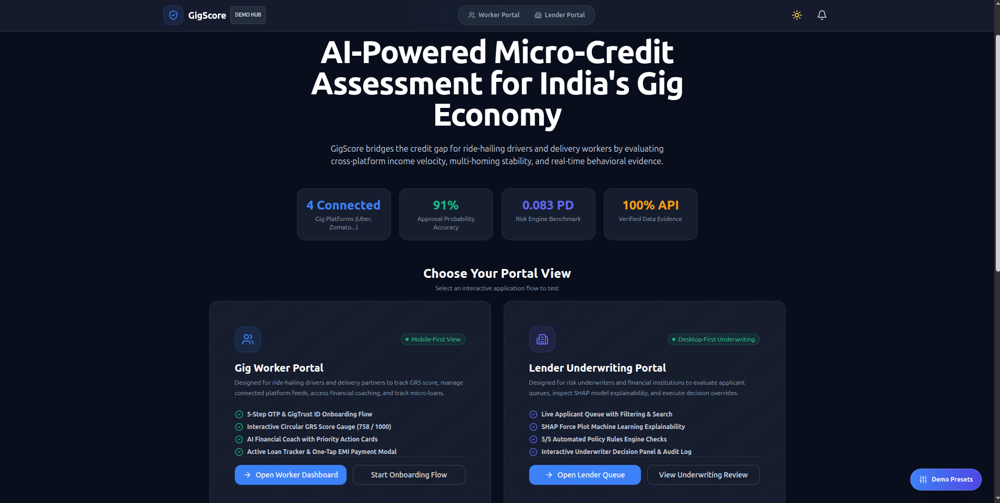
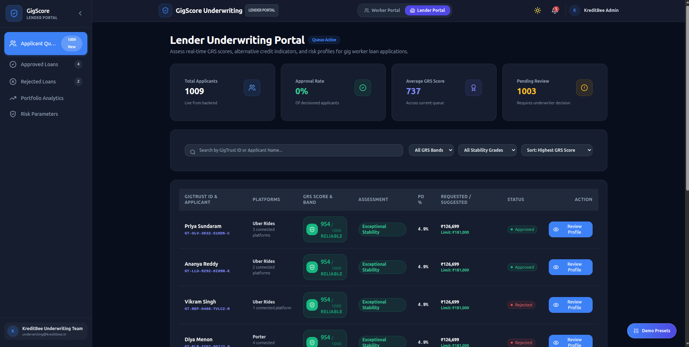
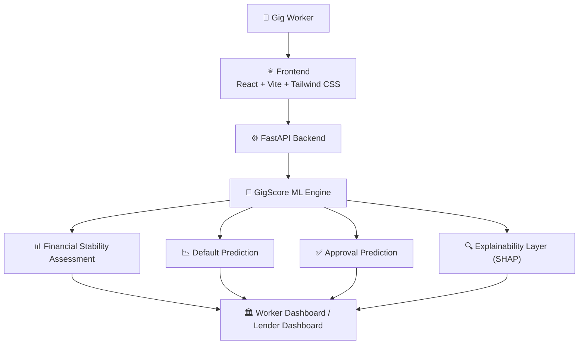

<div align="center">

# 🛡️ GigScore

### Financial Stability Assessment Engine for Gig Workers

**Built for HackMatrix 2026 · IEEE Computer Society · MITS Gwalior**
<br/>
<sub>Team <b>Victus</b></sub>

<br/>


<br/>

[](https://gig-score-two.vercel.app)
[](https://gigscore.onrender.com/docs)
[](HOW_TO_RUN.md)

<br/>



<sub><i>▶ Live on Vercel + Render — 4 connected platforms, 91% approval probability accuracy, 1,009 real demo applicants.</i></sub>

</div>

---

## Why We Built GigScore

A delivery partner may complete hundreds of orders every month, earn consistently across
multiple platforms, and still be rejected for a basic loan because they do not have a
traditional salary slip.

That is the problem we wanted to solve.

GigScore is an **explainable AI-powered financial assessment engine** that helps lenders
evaluate gig workers using alternative financial and behavioral signals instead of relying
only on salary-based income proof. Our goal is to make credit assessment more transparent,
practical, and inclusive for the growing gig economy.

## The Problem

India's gig workforce is expanding rapidly, but many workers remain underserved by formal
financial institutions because their income is:

- Irregular across weeks and months
- Spread across multiple platforms
- Difficult to represent through conventional salary documents

As a result, many gig workers face loan rejections, high-interest credit offers, or
dependence on informal lenders.

## Our Approach

GigScore converts fragmented financial activity into a structured financial stability
assessment that can assist banks, NBFCs, and fintech lenders in making more
evidence-based decisions.

The platform generates:

- **GigScore Reliability Score (GRS)** — a single 300–1000 score built from 5 weighted pillars
- **Probability of Default (PD)**
- **Approval Probability & suggested loan amount**
- **Explainable AI insights** (pillar-level breakdown, fraud-check flag)
- **Personalized financial coaching recommendations**
- **Lender-friendly decision support** — a full applicant queue, portfolio risk exposure view, and audit-tracked approve/reject flow

## 🌐 Live Demo

| | |
| :--- | :--- |
| 🖥️ **Frontend** | [gig-score-two.vercel.app](https://gig-score-two.vercel.app) — deployed on Vercel |
| 🔌 **Backend API** | [gigscore.onrender.com](https://gigscore.onrender.com/docs) — deployed on Render (free tier) |

> ⚠️ **Cold start notice:** the backend is on Render's free tier, which spins down after periods of
> inactivity. If the Lender Portal shows a loading error on first visit, open the
> [API link](https://gigscore.onrender.com/applicants) directly once to wake it up (~30–60s), then
> refresh the app.

<div align="center">

<br/>
<sub><i>▶ The Lender Underwriting Portal — a live queue of 1,009 real applicants, each with a GRS score, PD rate, and one-click approve/reject.</i></sub>
</div>

## 🧠 System Architecture



Each stage produces an input for the next: the assessment stage answers *how reliable is
this worker*, the default model answers *how likely are they to default*, and the approval
model turns both into an actual lending decision — with SHAP-based explainability
threaded through so every number is traceable back to real behavioral evidence, not a
black box.

## 🚀 Quickstart

<details open>
<summary><b>🐍 Backend — FastAPI</b></summary>

<br/>

```bash
cd backend
python3 -m venv venv
source venv/bin/activate       # Windows: venv\Scripts\activate
pip install -r requirements_full.txt
python -m uvicorn main:app --reload
```

Runs at `http://127.0.0.1:8000`. Always use `python -m uvicorn`, not plain `uvicorn` — plain
`uvicorn` can resolve to a different system-wide install and throw a false `ModuleNotFoundError`.

</details>

<details open>
<summary><b>⚛️ Frontend — React + Vite</b></summary>

<br/>

```bash
cd frontend
cp .env.example .env
npm install
npm run dev      # → http://localhost:5173
```

</details>

> 📖 Full setup instructions for both **Windows** and **Linux/macOS**, plus troubleshooting, are in
> [**HOW_TO_RUN.md**](HOW_TO_RUN.md).

## 📊 The GRS Score Breakdown

Every GigScore Reliability Score is built from **5 weighted pillars**, each normalized 0–1:

| Pillar | Weight | What it captures |
| :--- | :---: | :--- |
| 💰 Earning | 25% | Cross-platform earnings velocity |
| 📅 Continuity | 20% | Active-day consistency over time |
| ⭐ Service | 20% | Ratings and service quality |
| 🏦 Financial | 20% | Financial stability signals |
| 🔒 Integrity | 15% | Fraud/integrity indicators |

<table>
<tr>
<td>🎯<br/><b>300–1000 scale</b></td><td>not a bureau score — a purpose-built reliability score, calibrated on the demo dataset's real min/max (436–954).</td>
</tr>
<tr>
<td>🔍<br/><b>Fully explainable</b></td><td>every score comes with its pillar breakdown, SHAP-based insight, and a fraud-check flag — not a black-box number.</td>
</tr>
<tr>
<td>♻️<br/><b>Deterministic</b></td><td>no randomness in the scoring model — same inputs always produce the same score, every time.</td>
</tr>
<tr>
<td>🚫<br/><b>No bureau dependency</b></td><td>zero reliance on CIBIL/bureau history, formal payslips, or a single employer — the exact things most gig workers don't have.</td>
</tr>
</table>

## 🏛️ Two Portals, One Backend

| | Worker Portal | Lender Portal |
| :--- | :--- | :--- |
| **Who it's for** | Gig workers checking their own score | Banks/lenders/NBFCs reviewing applicants |
| **Key views** | Score dashboard, pillar breakdown, financial coaching, loan tracker | Applicant queue, portfolio analytics, risk exposure, decision support reports |
| **Core files** | `frontend/src/worker/` | `frontend/src/lender/` |
| **Decision flow** | View-only | Approve / reject with full audit trail |

Both portals hit the **same** `GET /applicants` and `GET /score/{id}` endpoints — no
duplicated backend logic, no mock fallbacks on the data lenders actually decide against.

## 📦 Repository Structure

<details>
<summary><b>Expand the file tree</b></summary>

```text
gigscore/
├── frontend/                    # User interface — React, Vite, Tailwind CSS
│   ├── src/
│   │   ├── worker/               # Worker Portal pages
│   │   ├── lender/                # Lender Portal pages
│   │   ├── pages/                  # Landing page
│   │   ├── components/             # Shared UI (ScoreBadge, Card, charts, etc.)
│   │   └── services/                # api.js — all backend calls live here
│   └── .env.example
├── backend/                      # FastAPI services
│   ├── main.py                    # Entry point
│   ├── routers/                    # identity, assessment, decision, ingest endpoints
│   ├── models/                      # DB models — worker, assessment, decision, audit_log
│   ├── services/                     # Glue layer between routers and the ML engine
│   └── gigscore.db                    # SQLite — ~1,009 demo worker/assessment rows
├── ml/                            # GigScore financial assessment engine
│   ├── m1_scorecard.py             # Financial Stability Assessment (GRS, 300–1000)
│   ├── m2_default_model.py          # Probability of Default
│   ├── m3_approval_model.py           # Approval + suggested loan amount
│   ├── predict.py                      # Orchestrates the full pipeline
│   ├── explain.py                       # SHAP explainability layer
│   ├── models/                           # Trained model artifacts + feature schema
│   └── docs/                              # Per-model design documentation
├── docs/                          # Documentation, architecture, and screenshots
├── HOW_TO_RUN.md                 # Cross-platform setup guide
└── README.md
```

</details>

## 🎁 Highlights

| | |
| :--- | :--- |
| 🧮 **Multi-stage ML pipeline** | Financial assessment → default prediction → approval, fully deterministic and explainable |
| 🏦 **Portfolio Risk Exposure view** | Aggregate ₹-exposure and PD-weighted expected loss across all applicants |
| 🔍 **Real explainability** | SHAP-driven pillar-score breakdown and fraud flag — not hardcoded placeholder data |
| 💬 **Financial coaching** | Personalized recommendations surfaced directly to workers, not just a score |
| 📊 **~1,009-row demo dataset** | Real (not mocked) data backing both portals end-to-end, live in production |
| 🌐 **Deployed and public** | Backend on Render, frontend on Vercel — anyone can try it right now |

## 🛠️ Technology Stack

**Frontend** React · Vite · Tailwind CSS &nbsp;|&nbsp;
**Backend** FastAPI · SQLAlchemy · SQLite &nbsp;|&nbsp;
**Machine Learning** Python · Scikit-learn · XGBoost · LightGBM · SHAP · NumPy · Pandas &nbsp;|&nbsp;
**Hosting** Render (backend) · Vercel (frontend)

## 👥 Team Victus

| Name | Role |
| :--- | :--- |
| **Shreesha Kumar P** | AI/ML & Product Architecture |
| **Chethan** | Backend & API Engineering |
| **Sameeksha** | Frontend & User Experience |
| **Shraddha Shetty GR** | Documentation, Integration & Demo Strategy *(Team Leader)* |

## 🎯 Current Focus

We are currently working on end-to-end integration across the frontend, backend, and
machine learning pipeline, along with explainability validation and demo optimization for
HackMatrix 2026.

---

<div align="center">

**GigScore** — creditworthy, not invisible.

<sub><b>Note:</b> GigScore is a prototype developed during HackMatrix 2026. It is intended for research,
demonstration, and decision-support purposes and does not provide lending services.</sub>

<br/><br/>

[MIT License](LICENSE) &nbsp;·&nbsp; © 2026 Team Victus

</div>
